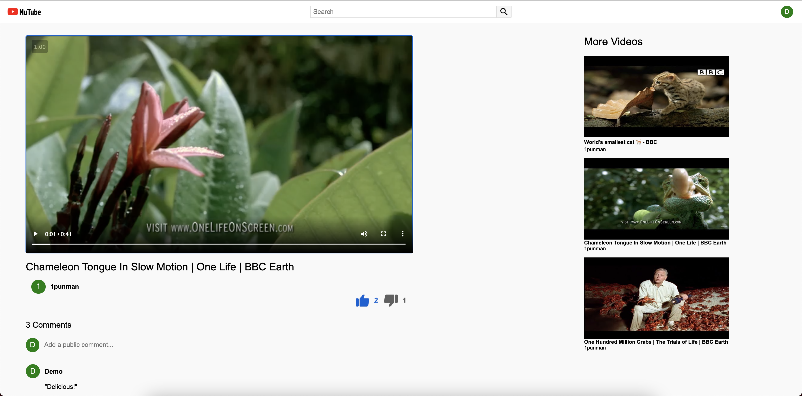
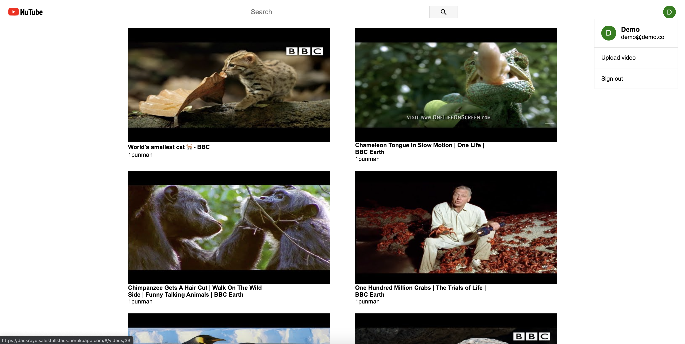

<h1 align="center"> 
  <br/>
  
  <br/>
  <p>NuTube</p>
</h1>

<a href="dackroydisalesfullstack.herokuapp.com"><h2 align="center">NuTube - A YouTube clone</h2></a>

<p align="center">
  <a href="#Key Features">Key Features</a> •
  <a href="#How NuTube Was Built">How NuTube Was Built</a> •
  <a href="Development Insights">Development Insights</a> •
  <a href="#Future Features">Future Features</a>
</p>

## Key Features

 • User account creation and login

 • Watch videos
 
 • Upload your videos to NuTube


  




<h1></h1>

## How NuTube Was Built

NuTube is a single-page full-stack app using:

- Ruby on Rails
- React/Redux
- JavaScript / AJAX / JBuilder
- HTML5 / CSS
- PostgreSQL

NuTube is a single-page app built on the React JavaScript library. The React Router JavaScript library is used to manage user navigation. The Rails API is queried with AJAX requests and returns JSON structures which are incorporated into the Redux state. 

## Development Insights

One of the most difficult design elements of NuTube was using the Rails API to perform database queries. JBuilder responses are sent from Rails to Redux and are used to update the state of our React components.

```rb

  def create 
    @user = User.find_by_credentials(
      params[:user][:email],
      params[:user][:password]
    )
    if @user
      login(@user)
      render "api/users/show"
    else
      render json: ["Invalid email/password combination"], status: 401
    end
  end

  def destroy
    @user = current_user
    if @user
      logout
      render "api/users/show"
    else 
      render json: ["Nobody signed in"], status: 404
    end
  end


```

Another key element of the NuTube interface is the user's dropdown menu while they are logged in - in particular, having the menu disappear when the user clicks elsewhere on the page. 

This feature was implemented by adding a document event listener on mousedowns when the UserDropdown component mounts, which updates the state of UserDropdown component depending on where the mousedown event occurred.

```js
class UserDropdown extends React.Component {
  constructor(props)
  {
    this.state = {open: false};
    this.container = React.createRef();
  }

  componentDidMount(){
    document.addEventListener("mousedown", this.handleClickOutside);
  }

  componentWillUnmount(){
    document.removeEventListener("mousedown", this.handleClickOutside);
  }

  handleClickOutside(event) {
    if(this.container.current && !this.container.current.contains(event.target)){
      this.setState({
        open: false
      });
    }
  }

```

## Future Features

  - Search for videos
  - Comment on videos
  - Like/dislike videos and comments
  - Display the number of plays for a video
  - Channel pages